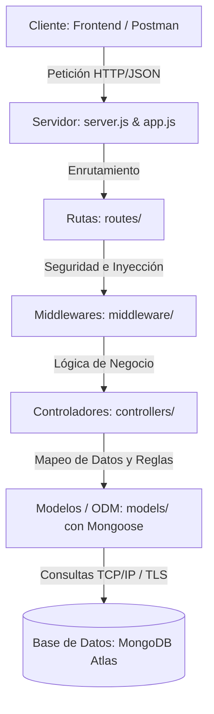
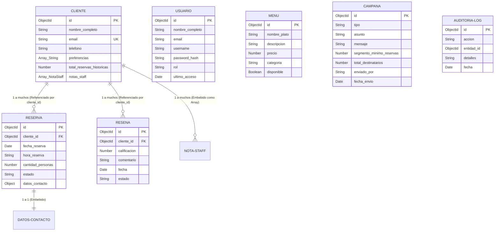

# Guía de Exposición: Sistema de Gestión de Reservas (Backend & Base de Datos)

Esta guía ha sido diseñada para estructurar tu exposición de base de datos de manera sólida, profesional y con un enfoque de arquitectura de software moderno. Aquí encontrarás los fundamentos teóricos, decisiones de diseño y detalles de implementación de la base de datos de tu proyecto.

---

## 1. El Proyecto y Objetivo de Negocio
El sistema es una **Plataforma de Gestión de Reservas para Restaurantes**. Su objetivo es optimizar la ocupación de mesas, automatizar el registro de clientes y sus preferencias, gestionar el menú digital, recopilar reseñas y permitir campañas de marketing segmentadas según el comportamiento de reserva de los clientes.

---

## 2. Stack Tecnológico y Justificación
El backend está construido sobre el ecosistema de JavaScript moderno:

*   **Runtime:** Node.js (v18+)
*   **Framework Web:** Express.js (v4+)
*   **Base de Datos:** MongoDB Atlas (Cloud Database)
*   **ODM (Object Document Mapper):** Mongoose (v8+)

### ¿Por qué elegir MongoDB (NoSQL) frente a una Base de Datos Relacional (SQL)?
Para un sistema de reservas moderno, MongoDB ofrece ventajas arquitectónicas clave:

1.  **Esquema Flexible (Polimorfismo):** Las preferencias de los clientes o los datos de contacto pueden cambiar o tener estructuras variadas sin necesidad de realizar migraciones de esquema complejas (`ALTER TABLE`).
2.  **Mapeo Directo con JavaScript (BSON):** Los documentos se almacenan en formato binario de JSON (BSON). No hay necesidad de un mapeo complejo de tablas relacionales a objetos (impedancia objeto-relacional). Un documento cliente en la base de datos se lee e interactúa directamente como un objeto JavaScript en Express.
3.  **Velocidad de Lectura (Desnormalización):** Al embeber documentos (por ejemplo, las notas del staff dentro del cliente), se obtienen los datos en una sola lectura física a disco, evitando operaciones de `JOIN` que consumen mucha CPU y memoria.
4.  **Escalabilidad Horizontal:** MongoDB está diseñado desde su núcleo para escalar mediante *sharding* (distribuir datos en varios servidores) de manera nativa, ideal para cadenas de restaurantes en crecimiento.
5.  **MongoDB Atlas:** Es la base de datos como servicio (DBaaS) oficial de MongoDB en la nube. Proporciona replicación automática de datos en tres nodos (Replica Sets) para garantizar alta disponibilidad (99.9% uptime) sin carga de administración de infraestructura.

---

## 3. Arquitectura del Sistema
El backend implementa una **Arquitectura en Capas (Layered Architecture)** con un diseño orientado a API REST. Esto desacopla las responsabilidades del sistema:



*   **Punto de Entrada (`server.js`):** Inicializa la conexión a la base de datos y, una vez exitosa, levanta el servidor Express.
*   **Configuración del Servidor (`src/app.js`):** Configura middlewares globales (CORS, JSON Parser) y registra los endpoints de la API (`/api/...`).
*   **Modelos (`src/models/`):** Definen los esquemas de datos utilizando Mongoose, aplicando validaciones, índices y hooks (triggers de ciclo de vida).

---

## 4. Modelo de Dominio y Diseño Entidad-Relación NoSQL
En bases de datos NoSQL basadas en documentos, el diseño Entidad-Relación cambia drásticamente. En lugar de relacionar todo mediante llaves foráneas en tablas separadas, aplicamos dos estrategias: **Documentos Embebidos (Denormalización)** y **Referencias (Normalización)**.

### Diagrama del Modelo Entidad-Relación (Híbrido)



### Justificación del Diseño de Relaciones

#### A. Relaciones Embebidas (1 a Muchos Embebido)
*   **Cliente → Notas del Staff (`notas_staff`):** El cliente tiene una lista de notas dejadas por los meseros o el personal (ej. *"Prefiere mesa en la terraza"*). Se modeló como un array de subdocumentos embebidos (`[NotaStaffSchema]`) dentro del documento `Cliente`.
    *   *Justificación:* Las notas son pequeñas, pertenecen únicamente a ese cliente y siempre se consultan cuando se visualiza el perfil del cliente. Evitamos hacer un Join secundario.
*   **Reserva → Datos de Contacto (`datos_contacto`):** Objeto embebido con `nombre` y `telefono`.
    *   *Justificación:* Es la información rápida de contacto para esa reserva específica (que podría variar del número principal del cliente). Al estar embebido, la lectura de la reserva es instantánea.

#### B. Relaciones Referenciadas (1 a Muchos Referenciado)
*   **Cliente → Reservas (`cliente_id`):** Una reserva tiene una referencia `cliente_id` que apunta al `_id` de la colección `clientes`.
    *   *Justificación:* Las reservas crecen indefinidamente en el tiempo. Si embebiéramos las reservas dentro del cliente, violaríamos el límite de tamaño de documento de MongoDB (16MB por documento) y degradaríamos el rendimiento. Usamos la referencia y en Express aplicamos `.populate('cliente_id')` cuando necesitamos los datos del cliente.
*   **Cliente → Reseñas (`cliente_id`):** Similar a reservas, cada reseña apunta al cliente que la escribió.

---

## 5. Estructura y Detalles Técnicos de la Base de Datos

Tu base de datos no es una simple colección de JSONs. Cuenta con características avanzadas de base de datos que debés destacar en la exposición:

### A. Colecciones
El clúster de MongoDB Atlas contiene las siguientes colecciones:
1.  `usuarios`: Credenciales de acceso del personal administrativo/staff (con contraseñas protegidas mediante hasheo con `bcryptjs`).
2.  `clientes`: Datos personales, preferencias y contador de reservas.
3.  `reservas`: Registro detallado de comensales, fechas y estados.
4.  `menu`: Catálogo de la oferta culinaria del restaurante.
5.  `resenas`: Puntuaciones de satisfacción enviadas por clientes.
6.  `campanas`: Registro de campañas de marketing masivas enviadas.
7.  `auditoria_logs`: Historial de operaciones críticas para auditoría de seguridad.

### B. Capped Collection (Colección Acotada)
La colección `auditoria_logs` se inicializa explícitamente en `src/config/db.js` como una **Capped Collection**:
*   **¿Qué es?** Es una colección de tamaño fijo que se comporta como una cola circular (First-In, First-Out - FIFO). Cuando la colección alcanza su límite físico de tamaño (1MB en nuestro caso) o el número máximo de documentos (1000), los documentos más antiguos son eliminados automáticamente para dar espacio a los nuevos.
*   **¿Por qué se usa aquí?** Para la bitácora de auditoría (logs de reservas creadas, accesos, etc.). Garantiza que el disco de la base de datos nunca se llene por el crecimiento ilimitado de logs y ofrece escrituras a velocidad de memoria, ya que los documentos se insertan en el orden físico del disco.

### C. Índices de Base de Datos (Database Indexes)
Para evitar escaneos de colección completa (*Collscan*) que ralentizan la base de datos, implementamos índices específicos:

1.  **Índices de Campo Único (Unique Indexes):**
    *   `email` en `Cliente` y `Usuario`: Previene duplicados a nivel de motor de base de datos.
    *   `username` en `Usuario`: Indexado para búsquedas rápidas durante el inicio de sesión.
2.  **Índices Compuestos (Compound Indexes):**
    *   `MenuSchema.index({ disponible: 1, categoria: 1 })`: Optimiza la consulta de la carta pública del restaurante, filtrando platos disponibles por categoría.
    *   `ReservaSchema.index({ fecha_reserva: 1, estado: 1 })`: Acelera la búsqueda de reservas activas o pendientes para un día específico.
    *   `ResenaSchema.index({ estado: 1, fecha: -1 })`: Permite obtener rápidamente las reseñas aprobadas ordenadas desde la más reciente a la más antigua para mostrarlas en la página web.
3.  **Índice TTL (Time-To-Live Index):**
    *   En `AuditoriaLogSchema`, el campo `fecha` tiene la propiedad `expires: 2592000` (30 días).
    *   *Mecanismo:* Un hilo en segundo plano de MongoDB evalúa periódicamente este campo y elimina físicamente los documentos cuya fecha sea mayor a 30 días. Esto automatiza la purga de logs antiguos.

### D. Vista Nativa de MongoDB (v_reservas_hoy)
En `src/config/db.js` configuramos una vista nativa de MongoDB llamada `v_reservas_hoy` sobre la colección `reservas`.
*   **¿Qué es una vista?** Es una colección virtual que expone los resultados de un pipeline de agregación predefinido. No almacena datos físicamente (no ocupa espacio extra), sino que ejecuta la consulta en tiempo real al ser invocada.
*   **Pipeline de la vista:**
    ```javascript
    const pipeline = [
      {
        $match: {
          estado: "confirmada",
          $expr: {
            $and: [
              { $gte: [ "$fecha_reserva", { $dateTrunc: { date: "$$NOW", unit: "day" } } ] },
              { $lt: [ "$fecha_reserva", { $dateAdd: { startDate: { $dateTrunc: { date: "$$NOW", unit: "day" } }, unit: "day", amount: 1 } } ] }
            ]
          }
        }
      }
    ];
    ```
    Filtra las reservas en estado "confirmada" cuya fecha esté comprendida en el día actual (`$$NOW` truncado al inicio del día y sumado 1 día para establecer el límite superior). Esto permite al personal ver las reservas del día de forma directa y optimizada.

### E. Mongoose Middleware (Triggers en Capa de Aplicación)
En `src/models/Reserva.js` implementamos hooks post-guardado (`post('save')` y `post('findOneAndUpdate')`) que actúan como **triggers de base de datos**:
1.  **Trigger de Consistencia / Denormalización:** Al guardarse una nueva reserva con éxito, automáticamente incrementa en 1 el contador `total_reservas_historicas` del cliente referenciado usando el operador atómico `$inc` de MongoDB.
2.  **Trigger de Auditoría:** Al crearse una reserva o actualizarse su estado (ej: cancelada), se inserta de manera automática un documento descriptivo en `auditoria_logs`.

---

## 6. Creación y Conexión de la Base de Datos al Backend

### ¿Cómo se creó la base de datos?
1.  **Clúster en la nube:** Se creó un clúster gratuito (M0) en **MongoDB Atlas** seleccionado en una región cercana (por ejemplo, AWS / us-east-1) para minimizar la latencia.
2.  **Seguridad de Red y Accesos:** Se configuró un usuario de base de datos con contraseña robusta y permisos de lectura/escritura (`readWriteAnyDatabase`). Se habilitó el acceso IP (Whitelisting) para permitir la conexión desde el entorno de desarrollo local y de producción.
3.  **Creación Implícita de Colecciones:** MongoDB no requiere un comando `CREATE DATABASE` o `CREATE TABLE`. Las colecciones se crean de forma implícita cuando el backend inserta el primer documento.
4.  **Población de Datos (Seeding):** Se desarrolló un script (`backend/scripts/seed.js`) que limpia la base de datos, inicializa la Capped Collection, encripta contraseñas por defecto usando `bcryptjs` e inserta registros base de platos del menú, usuarios de prueba, clientes y reservas para pruebas iniciales (`npm run seed`).

### ¿Cómo se conecta la base de datos al backend?

#### 1. Variables de Entorno (Seguridad ante todo)
La cadena de conexión (URI) provista por MongoDB Atlas contiene credenciales sensibles. Se almacena de forma segura en el archivo local `.env` (el cual está excluido del control de versiones `.gitignore`):

```bash
MONGO_URI=mongodb+srv://<usuario>:<password>@cluster0.xxxx.mongodb.net/sistema_reservas?retryWrites=true&w=majority
```

#### 2. Configuración de Mongoose (`src/config/db.js`)
Mongoose gestiona un pool de conexiones TCP. La conexión se establece con:

```javascript
const mongoose = require('mongoose');

const connectDB = async () => {
  try {
    const conn = await mongoose.connect(process.env.MONGO_URI);
    console.log(`MongoDB Conectado: ${conn.connection.host}`);
    
    // Aquí el backend también verifica y crea la capped collection de logs y la vista de reservas si no existen.
  } catch (error) {
    console.error(`Error de conexión a MongoDB: ${error.message}`);
    process.exit(1); // Detiene la aplicación si no se conecta a la base de datos
  }
};
```

#### 3. Inicialización en el Ciclo de Vida del Servidor (`server.js`)
Para evitar que Express reciba peticiones HTTP antes de que la base de datos esté lista, el servidor inicia de manera secuencial:

```javascript
const app = require('./src/app');
const connectDB = require('./src/config/db');

const PORT = process.env.PORT || 5000;

const startServer = async () => {
  try {
    // 1. Espera a que la base de datos se conecte exitosamente
    await connectDB();

    // 2. Levanta el servidor Express una vez conectados
    app.listen(PORT, () => {
      console.log(`Servidor escuchando en http://localhost:${PORT}`);
    });
  } catch (error) {
    console.error('Error al arrancar el servidor:', error.message);
    process.exit(1);
  }
};

startServer();
```

---

## 7. Consejos y Preguntas Clave del Profesor para la Exposición

1.  **¿Por qué usaron Mongoose si MongoDB es esquemeless (sin esquema)?**
    *   *Respuesta:* MongoDB no tiene esquema a nivel de motor de base de datos, lo que da flexibilidad. Sin embargo, a nivel de **código de aplicación** necesitamos consistencia para asegurar que no se guarden datos corruptos (ej. una reserva sin fecha o un email sin formato válido). Mongoose actúa como esa capa de validación en el backend, definiendo esquemas estrictos a nivel lógico sin perder la flexibilidad del motor NoSQL.
2.  **¿Cómo manejan las relaciones si es NoSQL?**
    *   *Respuesta:* NoSQL no significa "sin relaciones", sino "sin joins obligatorios". Usamos un diseño híbrido: **referencias** mediante `ObjectId` para relaciones que crecen infinitamente (como clientes y reservas) y realizamos la unión mediante la función `.populate()` de Mongoose en las consultas; y **documentos embebidos** para relaciones de ciclo de vida dependiente y acotadas (como las notas de staff dentro del cliente).
3.  **¿Qué es una Capped Collection y cuándo no debería usarse?**
    *   *Respuesta:* Es una colección de tamaño fijo automático que sobreescribe los datos antiguos. **No** debe usarse para datos críticos del negocio (como usuarios, transacciones o reservas) porque se perderían registros viejos al llenarse. Es ideal únicamente para logs de auditoría, bitácoras de errores o almacenamiento en caché temporal.
4.  **¿Por qué usar índices y qué costo tienen?**
    *   *Respuesta:* Los índices mejoran drásticamente la velocidad de lectura al crear estructuras de datos ordenadas (árboles B) que permiten búsquedas en tiempo logarítmico. Sin embargo, tienen un costo: ocupan espacio en disco y memoria RAM, y ralentizan ligeramente las escrituras (`insert`, `update`, `delete`), ya que el motor debe actualizar el índice cada vez que cambian los datos. Por eso indexamos únicamente los campos críticos de consulta.

---

## 8. Casos de Uso Prácticos: Del Código a la Web (Explicado Simple)

Para lucirte en la exposición, podés explicar cómo estas características avanzadas de base de datos se traducen directamente en funcionalidades reales que el usuario ve y experimenta en la aplicación web:

### Caso 1: La Vista de "Reservas del Día"
*   **En la Base de Datos:** Tenemos la vista nativa `v_reservas_hoy` configurada sobre la colección de `reservas`.
*   **En el Código Backend (`dashboardController.js`):** Cuando el backend recibe una consulta en el endpoint de reservas de hoy, ejecuta:
    ```javascript
    const reservasHoy = await db.collection('v_reservas_hoy').find({}).toArray();
    ```
*   **En la Interfaz Web (Frontend):** Cuando el personal abre el dashboard por la mañana, la web hace una petición a la API y carga esa lista.
*   **El Resultado en la Web:** El staff ve una lista limpia y en tiempo real únicamente de los clientes que tienen mesas reservadas para el día de hoy, descartando de inmediato las reservas de días pasados o canceladas. Todo resuelto a nivel de base de datos de manera sumamente eficiente y sin lógica compleja en el frontend.

### Caso 2: El Gráfico de "Ocupación por Horas" (Agregación)
*   **En la Base de Datos (Concepto SQL: Group By / Stored Procedures):** Usamos un pipeline de agregación en MongoDB.
*   **En el Código Backend (`dashboardController.js`):** Agrupamos y sumamos la cantidad de personas reservadas en cada hora mediante el método `aggregate`:
    ```javascript
    const ocupacion = await Reserva.aggregate([
      { $match: { fecha_reserva: { $gte: startOfDay, $lte: endOfDay }, estado: { $ne: 'cancelada' } } },
      { $group: { _id: '$hora_reserva', total_personas: { $sum: '$cantidad_personas' } } }
    ]);
    ```
*   **En la Interfaz Web (Frontend):** La web solicita la ocupación por horas y renderiza un gráfico visual.
*   **El Resultado en la Web:** El administrador ve un gráfico de barras que muestra a qué horas tendrá mayor cantidad de clientes cenando (por ejemplo, 40 personas a las 20:30 y solo 10 a las 22:30). Esto le permite planificar cuántos meseros y cocineros necesita activos en cada turno.

### Caso 3: Triggers de Consistencia y Auditoría (Hooks de Mongoose)
*   **En la Base de Datos (Concepto SQL: Triggers):** Usamos los Hooks `post('save')` de Mongoose para que se ejecuten automáticamente al guardar una reserva.
*   **En el Código Backend (`models/Reserva.js`):** Al insertarse una reserva, se dispara un trigger que actualiza el historial del cliente y registra el evento:
    ```javascript
    Cliente.findByIdAndUpdate(doc.cliente_id, { $inc: { total_reservas_historicas: 1 } });
    AuditoriaLog.create({ accion: 'RESERVA_CREADA', detalles: 'Nueva reserva creada...' });
    ```
*   **En la Interfaz Web (Frontend):** 
    1.  **Formulario de Reserva:** El cliente llena sus datos en la web y da click en "Reservar".
    2.  **Dashboard del Administrador:** El staff ve un feed dinámico que se actualiza.
*   **El Resultado en la Web:**
    *   *Para el Administrador:* En el panel de auditoría (Activity Feed) aparece instantáneamente una línea: *"Nueva reserva creada para Carlos Díaz (4 personas)..."*.
    *   *Para el CRM:* La ficha de "Carlos Díaz" pasa automáticamente de tener 4 reservas a tener 5 reservas acumuladas en su historial. El administrador puede ver a sus clientes más fieles actualizados al segundo sin intervención manual.

